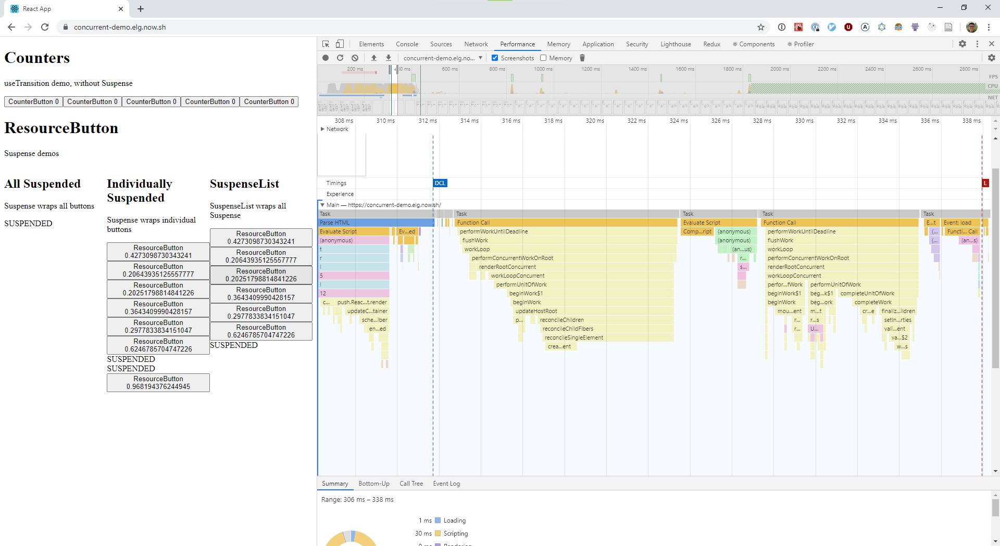

# React Concurrent Mode and Suspense Demo

<https://concurrent-demo.elg.now.sh/>

A simple app demoing React Suspense and Concurrent Mode with a custom build of
the latest version of React (at build time), with scheduling profiler marks
enabled. Supporting work on the React scheduling profiler, previously as part of
the MLH Fellowship.

This project was bootstrapped with [Create React App](https://github.com/facebook/create-react-app),
but ejected so that we can bundle React in development mode and disable
minifying.

## Usage

To increase your dev velocity, I'll recommend these steps below to set up
both this project and React.

1. Clone both this repo and React's repo.
1. In both folders, run `yarn` to install dependencies.
1. In the react folder, run `yarn build react-dom/index,react/index,react-cache,scheduler --type=NODE_DEV,NODE_PROFILING`. The
   resulting files will be in build/node_modules.
1. `cd` back to this project (or `cd` in in another terminal window/tab/pane)
1. Run `npx nodemon -w ../react/build/node_modules -x 'npx cross-env SKIP_PREFLIGHT_CHECK=true BROWSER=none yarn start'`. This will watch React's
   build folder for changes, copy its built code over and restart the app.
1. `cd` back to the react folder (or go back to the other window/tab/pane),
   and run `yarn build react-dom/index,react/index,react-cache,scheduler --type=NODE_DEV,NODE_PROFILING --watch`. This will watch the React code for changes and
   compile any changes quickly. You must do this after the previous step, as
   the previous step copies necessary files that React's build watch script
   will nuke.

If you've done the above steps correctly, you should be able to trigger a
recompile in this app when a file in the React codebase is changed. You'll
still need to refresh your browser tab though, since WDS will be stopped and
restarted.

To enable React's experimental debug tracing logger: in the react folder, set
the `enableDebugTracing` flag to true in
`packages/shared/ReactFeatureFlags.js`.

## Deployment

- `yarn build`: builds this app. `yarn prebuild` (automatically run on
  `yarn build`) will expect and copy your built version of React from
  ../react.
- `yarn build-for-deployment` will clone our custom fork of React, configure
  React (i.e. flip relevant feature flags) and then run `yarn build`.
  Suitable for use with static hosting services (e.g. vercel.com).
